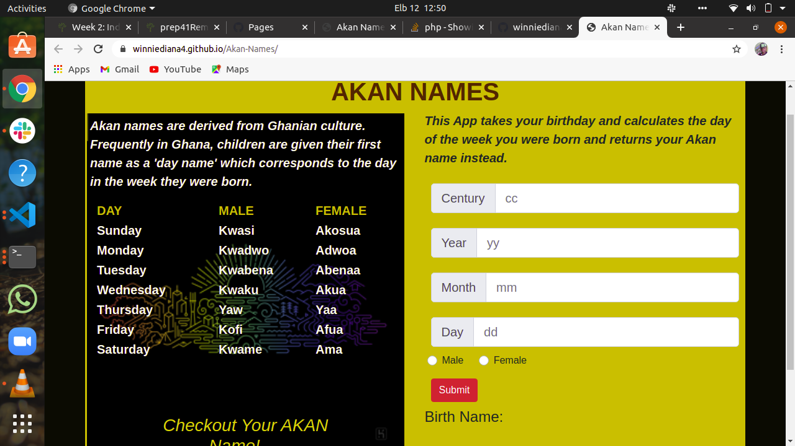

# Akan-Names
#### Birthdate generator {12/04/2021}
#### Author
Winnie Diana Anyango
## Description
This App takes your birthday and calculates the day of the week you were born and returns your Akan name instead
### Prerequisites
You need to have git installed
You can install it with the following command in your terminal
`$ sudo apt install git-all`
### Setup
To access this project on your local files, you can clone it using these steps
1. Open your terminal
1. Use this command to clone `$ git clone https://github.com/winniediana4/Akan-Names.git`
1. This will clone the repository into your local folder
### Live Site
View [live](https://winniediana4.github.io/Akan-Names/) 
## Known Bug
{No known bugs.}
# Project screenshot

## Technologies Used
1. HTML
1. CSS
1. JS
## Support and contact details
For inquiries, comments or contributions, you can reach me at winnie.anyango@student.moringaschool.com
### License
This project is under the [MIT](LICENSE) license